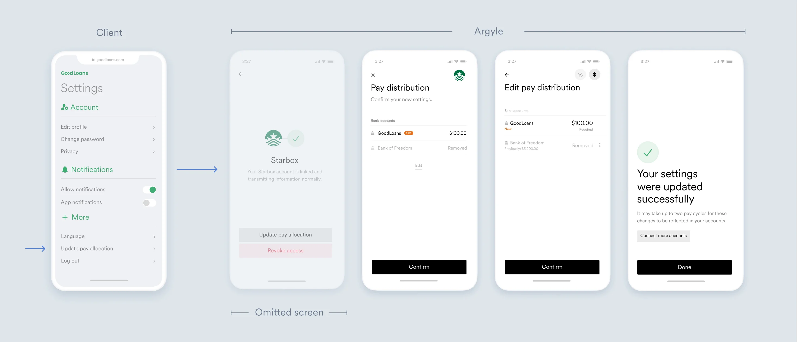
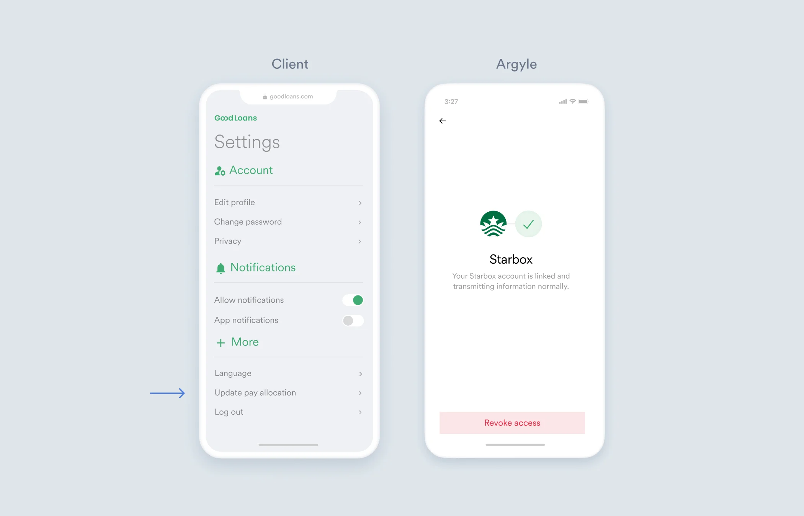

# Manage connected accounts

In this page, you'll discover how to configure and update user data connected through Argyle.

## Overview

Argyle allows lenders access to employment and income information through a connected user account. Argyle is a user-permissioned platform, which means users consent to provide continous access of their data to lenders. Argyle uses [Link](https://argyle.com/docs/products/link-4) to improve and simplify the customer experience. Link allows you to customize and tailor user settings to match your user needs, while maintaing regulatory compliance.

## Account management sample

In the following example, GoodLoans has a Settings page that offers customers access to manage their account. Users can change user information, update their data, or revoke access.

> [!IMPORTANT] Clients must remove all data on a user if they revoke access.

<!-- Update pay allocation isn't the best title for this section, especially since it covers more than one user goal (Update a data point, remove all data points)>
-->

### Access

Argyle implements a simple user token for managing client accounts. For example, the code below shows Link initialization for a new user:

```html
<!DOCTYPE html>
<html>
  <head>
    <meta charset="utf-8" />
  </head>
  <body>
    <script src="https://plugin.argyle.com/argyle.web.v3.js"></script>
    <script type="text/javascript">
      const argyle = Argyle.create({
        linkKey: 'YOUR_LINK_KEY', // insert your Link key here. It can be found in the Argyle Console.
        apiHost: 'https://api-sandbox.argyle.com/v1', // sandbox environment is used in this example. Change to production environment before launching.
        onUserCreated: ({ userId, userToken }) => {
          console.log('User created: ', userId, 'User token:', userToken)
        } // save the userId and userToken
      })
      argyle.open()
    </script>
  </body>
</html>

```

This token prevents duplicate user connections and takes customers to the same point in the Argyle flow.

### Update pay allocation

The Update pay allocation section allows users to update their documents. This can then attach to a `document` webhook to update whenever the user adds a new document. 



### Revoke access

In the GoodLoans example below, users can revoke access under **Update pay allocation** > **Revoke access**. You can setup webhooks through [Link](https://argyle.com/docs/developer-tools/api-reference#link-items-list-link-items) to notify you when a user revokes access.


## Additional resources

- [Configuration parameters](https://argyle.com/docs/products/argyle-link#upgrade-to-the-latest-version-of-the-link-sdk)
- [Returning users experience](https://argyle.com/docs/products/returning-users-experience)
- [Document upload](https://argyle.com/docs/products/document-upload)
